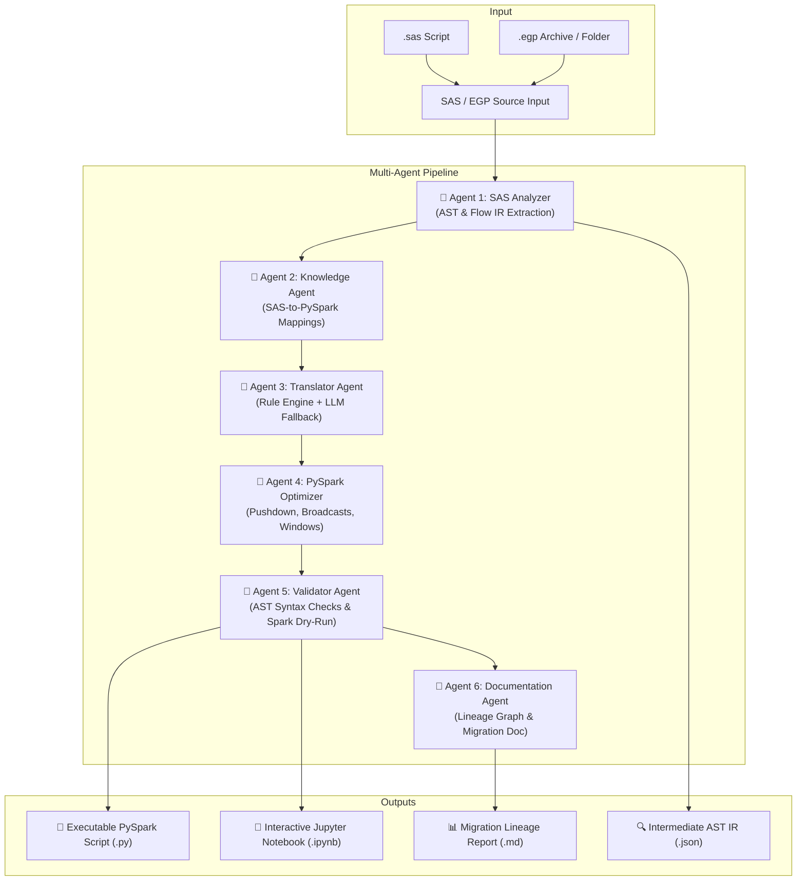

# ⚡ SAS to PySpark Converter AI Agent

A production-grade, modular AI Agent and multi-agent toolkit designed to automatically parse, transpile, optimize, validate, and document the conversion of **SAS scripts (`.sas`)** and **SAS Enterprise Guide projects (`.egp`)** into clean, idiomatic, and executable **PySpark** code (Python scripts & Jupyter Notebooks).

---

## 🌟 Key Features

1. **Dual SAS & EGP Project Parsing**:
   - **SAS Scripts (`.sas`)**: Parsed into logical Abstract Syntax Tree (AST) blocks (`DATA` steps, `PROC SQL`, `PROC SORT`, `PROC TRANSPOSE`, `PROC FREQ`, `PROC SUMMARY`, `PROC MEANS`, `PROC IMPORT`, `PROC EXPORT`, `%LET`, Macros).
   - **Enterprise Guide (`.egp`)**: Directly parses zipped `.egp` archives or unzipped project folders, extracts `project.xml` process flows, models task nodes, resolves dependencies, and builds an execution DAG.

2. **Deterministic Rule Engine + AST Transpiler**:
   - Translates `PROC SQL` queries to Spark SQL (`spark.sql(...)`) with dialect normalizations.
   - Maps SAS `DATA` step operations (`WHERE`, `KEEP`, `DROP`, `IF-THEN`, variable calculations) to native PySpark DataFrame transformations (`.filter()`, `.select()`, `.withColumn()`).
   - Converts `FIRST.var`, `LAST.var`, and `RETAIN` into PySpark `Window.partitionBy()` specifications.
   - Maps 20+ SAS built-in functions (`SUBSTR`, `UPCASE`, `LOWCASE`, `STRIP`, `TODAY`, `COALESCE`, `ROUND`, `YEAR`, `MONTH`, `INTNX`, `SCAN`, `TRIM`) to `pyspark.sql.functions as F`.

3. **6-Agent Cooperative Multi-Agent Orchestration**:
   - **Agent 1 (SAS Analyzer)**: AST extraction, semantic analysis, and Flow IR graph construction.
   - **Agent 2 (Knowledge Agent)**: Construct mapping library and PySpark best-practice retrieval.
   - **Agent 3 (Translator Agent)**: AST-to-DataFrame transpilation with intelligent LLM fallback (Groq / Gemini).
   - **Agent 4 (Optimizer Agent)**: Applies predicate pushdown, broadcast joins, cached DataFrames, and partitioning.
   - **Agent 5 (Validator Agent)**: Validates Python AST syntax and performs optional PySpark dry-runs.
   - **Agent 6 (Documentation Agent)**: Builds data lineage graphs and markdown migration reports.

4. **Multi-Format Pipeline Output**:
   - Generates standalone, production-ready `.py` PySpark scripts formatted with `black`.
   - Generates interactive `.ipynb` Jupyter Notebooks with markdown step-by-step descriptions, original SAS references, and code cells.
   - Generates intermediate AST IR JSON for debugging and lineage verification.
   - Generates markdown migration lineage reports (`<name>_migration_lineage.md`).

5. **Rich CLI & DAG Inspector**:
   - Typer & Rich powered CLI with interactive dashboard summary tables and colorized tree graphs of EGP process flows.

---

## 🏗️ Architecture & Agent Flow



---

## 📦 Prerequisites

- **Python**: 3.10, 3.11, or 3.12
- **Java** *(Optional, required only for local PySpark session validation / dry-run)*: Java 8, 11, or 17 (OpenJDK recommended)
- **LLM API Key** *(Optional, rule engine works 100% offline; LLM used for complex edge cases)*:
  - [Groq API Key](https://console.groq.com/) (Default: `llama-3.3-70b-versatile`)
  - [Google Gemini API Key](https://aistudio.google.com/) (Default: `gemini-2.5-flash`)

---

## 🚀 Installation & Setup

### 1. Clone the Repository
```bash
git clone https://github.com/buildwithabbi/sas-to-pyspark-convertor-agent.git
cd sas-to-pyspark-convertor-agent
```

### 2. Create and Activate Virtual Environment
```bash
python3 -m venv .venv
source .venv/bin/activate
```

### 3. Install Dependencies
```bash
pip install -r requirements.txt
pip install -e .
```

### 4. Configure Environment Variables
Copy `.env.example` to `.env` and configure your API keys (if using LLM fallback):
```bash
cp .env.example .env
```
Edit `.env`:
```ini
# Groq API (Recommended)
GROQ_API_KEY=your_groq_api_key_here
GROQ_MODEL_NAME=llama-3.3-70b-versatile

# Google Gemini API (Alternative)
GEMINI_API_KEY=your_gemini_api_key_here
GEMINI_MODEL_NAME=gemini-2.5-flash

# Provider selection: "groq", "gemini", or "auto"
LLM_PROVIDER=auto
ENABLE_LLM_FALLBACK=true
```

---

## 📖 Instructions for Use

The converter provides two primary execution interfaces:
1. **Multi-Agent Orchestrator (`app.py`)**: Full 6-agent cooperative pipeline with optimization, validation, dry-run, and lineage report generation.
2. **Fast CLI Interface (`sas2pyspark` / `main.py`)**: Standalone CLI for single file, EGP archive, batch conversions, and EGP DAG inspection.

---

### Option A: Using the Multi-Agent Orchestrator (`app.py`)

Run the complete 6-agent cooperative pipeline:

```bash
# Convert a SAS script
python app.py run sample_sas/sample_etl.sas --out ./output

# Convert an EGP project file
python app.py run path/to/project.egp --out ./output

# Run with local PySpark dry-run execution validation
python app.py run sample_sas/sample_etl.sas --out ./output --dry-run

# Disable intermediate IR dump
python app.py run sample_sas/sample_etl.sas --out ./output --no-dump-ir
```

#### Generated Outputs in `./output/`:
| File | Description |
| :--- | :--- |
| `<name>_converted.py` | Standalone, runnable PySpark script |
| `<name>_converted.ipynb` | Interactive Jupyter Notebook with documentation & PySpark cells |
| `<name>_migration_lineage.md` | Data lineage graph and detailed step-by-step conversion summary |
| `<name>_intermediate_ir.json` | Extracted Abstract Syntax Tree (AST) & flow intermediate representation |

---

### Option B: Using the CLI Tool (`sas2pyspark` or `python main.py`)

The CLI provides fast conversions, batch folder processing, format selection, and EGP flow inspection.

#### 1. Convert a Single SAS Script (`.sas`)
```bash
# Convert to both PySpark script and Jupyter Notebook
sas2pyspark convert sample_sas/sample_etl.sas --out ./output

# Output only PySpark script (.py)
sas2pyspark convert sample_sas/sample_etl.sas --format script --out ./output

# Output only Jupyter Notebook (.ipynb)
sas2pyspark convert sample_sas/sample_etl.sas --format notebook --out ./output

# Export intermediate AST IR JSON
sas2pyspark convert sample_sas/sample_etl.sas --dump-ir --out ./output
```

#### 2. Convert an Enterprise Guide Project (`.egp`)
```bash
# Convert a .egp zip archive
sas2pyspark convert path/to/NetflixHistory43.egp --out ./output

# Convert an unzipped EGP project folder containing project.xml
sas2pyspark convert path/to/unzipped_egp_dir/ --out ./output
```

#### 3. Batch Convert a Directory
```bash
# Batch process all .sas and .egp files in a folder
sas2pyspark convert path/to/sas_scripts_folder/ --out ./output
```

#### 4. Inspect EGP Process Flow & Dependency DAG
Inspect node execution order and upstream/downstream dependencies without running conversion:
```bash
sas2pyspark inspect path/to/NetflixHistory43.egp
```

Output tree:
```
📁 EGP Project Flow: NetflixHistory43
├── ⚙️ Import Raw Data (ID: node_1) - 💻 Has SAS Code
│   └── ➡️ Downstream: Clean History, Filter Active
├── ⚙️ Clean History (ID: node_2) - 💻 Has SAS Code
│   ├── ⬅️ Upstream: Import Raw Data
│   └── ➡️ Downstream: Aggregate Metrics
└── ⚙️ Aggregate Metrics (ID: node_3) - 💻 Has SAS Code
    └── ⬅️ Upstream: Clean History
```

#### 5. Check Version
```bash
sas2pyspark version
```

---

### Option C: Programmatic Python API

You can also use `sas2pyspark` inside your own Python code or pipelines:

```python
from sas2pyspark.parsers import SASParser, EGPParser
from sas2pyspark.agent import SAS2PySparkAgent
from sas2pyspark.generator import ScriptBuilder, NotebookBuilder

# 1. Parse SAS code into AST blocks
parser = SASParser()
sas_code = """
DATA work.high_value_cust;
    SET source.customers;
    WHERE total_spend > 1000;
    status = UPCASE(tier);
    KEEP customer_id total_spend status;
RUN;
"""
blocks = parser.parse_script(sas_code)

# 2. Transpile blocks with AI Agent & Rule Engine
agent = SAS2PySparkAgent()
converted_blocks = [agent.convert_block(b) for b in blocks]

# 3. Generate PySpark Python script
script = ScriptBuilder.build_script(converted_blocks, "customer_etl.sas")
print(script)

# 4. Generate Jupyter Notebook JSON
notebook = NotebookBuilder.build_notebook(converted_blocks, "customer_etl.sas")
```

---

## 📊 SAS to PySpark Translation Coverage

| SAS Construct | PySpark Implementation | Status |
| :--- | :--- | :---: |
| **`DATA ... SET`** | `df = spark.table(...)` or `.read.parquet(...)` | ✅ Full |
| **`WHERE` condition** | `df.filter(...)` | ✅ Full |
| **`KEEP` / `DROP`** | `df.select(...)` / `df.drop(...)` | ✅ Full |
| **`IF-THEN-ELSE`** | `F.when(...).otherwise(...)` | ✅ Full |
| **`RETAIN` / Accumulators** | `F.sum().over(Window.partitionBy().orderBy())` | ✅ Full |
| **`BY` Grouping (`FIRST.x` / `LAST.x`)** | `Window.partitionBy("x").orderBy(...)` + `F.row_number()` | ✅ Full |
| **`PROC SQL`** | `spark.sql("""...""")` + Dialect mappings | ✅ Full |
| **`PROC SORT`** | `df.sort(...)` / `df.orderBy(...)` | ✅ Full |
| **`PROC SUMMARY` / `MEANS`** | `df.groupBy(...).agg(...)` | ✅ Full |
| **`PROC FREQ`** | `df.groupBy(...).count()` or `df.crosstab(...)` | ✅ Full |
| **`PROC TRANSPOSE`** | `df.groupBy(...).pivot(...)` | ✅ Full |
| **`PROC IMPORT` / `EXPORT`** | `spark.read.csv(...)` / `df.write.parquet(...)` | ✅ Full |
| **`%LET` Macro Variables** | Python variable assignment & f-string interpolation | ✅ Full |
| **String Functions** (`SUBSTR`, `UPCASE`, `STRIP`, etc.) | `F.substring()`, `F.upper()`, `F.trim()` | ✅ Full |
| **Date Functions** (`TODAY()`, `INTNX`, `YEAR`, `MONTH`) | `F.current_date()`, `F.add_months()`, `F.year()` | ✅ Full |

---

## 🧪 Testing

Run the test suite using `pytest`:

```bash
pytest -v
```

Run specific test modules:
```bash
# Test multi-agent orchestration
pytest tests/test_agents.py -v

# Test SAS parsing
pytest tests/test_sas_parser.py -v

# Test EGP parsing and DAG construction
pytest tests/test_egp_parser.py -v

# Test transpiler rules and functions
pytest tests/test_transpiler.py -v
```

---

## 📂 Project Structure

```
sas-to-pyspark-convertor-agent/
├── app.py                     # Multi-Agent Orchestrator CLI
├── main.py                    # Fast CLI Entrypoint (wraps sas2pyspark.cli)
├── config.py                  # Global application configuration
├── requirements.txt           # Python package dependencies
├── pyproject.toml             # Package metadata & build definition
├── task-notes.md              # Project specifications & architecture notes
├── README.md                  # Project documentation & usage instructions
│
├── agents/                    # 6-Agent Cooperative Framework
│   ├── analyzer.py            # Agent 1: SAS Analyzer (AST & Flow IR)
│   ├── knowledge.py           # Agent 2: SAS Knowledge Base & Mapping Rules
│   ├── translator.py          # Agent 3: Rule + LLM Translator Agent
│   ├── optimizer.py           # Agent 4: PySpark Performance Optimizer
│   ├── validator.py           # Agent 5: AST Syntax & PySpark Dry-Run Validator
│   ├── documentation.py       # Agent 6: Documentation & Lineage Graph Agent
│   └── vector_store.py        # Semantic vector similarity search
│
├── sas2pyspark/               # Core Engine & Standalone CLI
│   ├── cli.py                 # Typer/Rich CLI implementation
│   ├── config.py              # Pydantic Settings
│   ├── models.py              # Pydantic AST, DAG, and Node data models
│   ├── parsers/               # SAS and EGP parsers
│   │   ├── egp_parser.py      # EGP project.xml & archive extractor
│   │   ├── sas_parser.py      # SAS script tokenizer & block extractor
│   │   └── sql_parser.py      # PROC SQL to Spark SQL transpiler
│   ├── transpiler/            # Deterministic transpilation modules
│   │   ├── data_step.py       # DATA step transpiler
│   │   ├── procs.py           # PROC SORT, SUMMARY, FREQ, TRANSPOSE
│   │   ├── functions.py       # SAS -> PySpark function registry
│   │   └── macros.py          # Macro variable resolution engine
│   ├── agent/                 # LLM fallback agent
│   │   ├── llm_agent.py       # LLM translation client (Groq/Gemini)
│   │   ├── prompts.py         # System prompts
│   │   └── validator.py       # AST validator
│   └── generator/             # Output builders
│       ├── script_builder.py  # PySpark .py script builder
│       └── notebook_builder.py# Jupyter .ipynb notebook builder
│
├── knowledge/                 # SAS-to-PySpark construct knowledge base
│   ├── sas_mapping.json       # Construct & function mapping database
│   └── examples.json          # Few-shot translation examples
│
├── prompts/                   # LLM Prompt Templates
│   ├── translator_prompt.txt  # Translation prompt
│   └── optimizer_prompt.txt   # PySpark optimization prompt
│
├── sample_sas/                # Sample SAS scripts for testing
│   └── sample_etl.sas         # Sample multi-step SAS ETL script
│
└── tests/                     # Test Suite
    ├── test_agents.py         # Multi-agent pipeline tests
    ├── test_egp_parser.py     # EGP parser tests
    ├── test_parser.py         # Generic parser tests
    ├── test_sas_parser.py     # SAS parser tests
    └── test_transpiler.py     # Transpiler rule tests
```

---

## 🤝 Contributing

1. Fork the repository.
2. Create your feature branch (`git checkout -b feature/amazing-feature`).
3. Commit your changes (`git commit -m 'Add amazing feature'`).
4. Push to the branch (`git push origin feature/amazing-feature`).
5. Open a Pull Request.

---

## 📄 License

This project is licensed under the MIT License.
